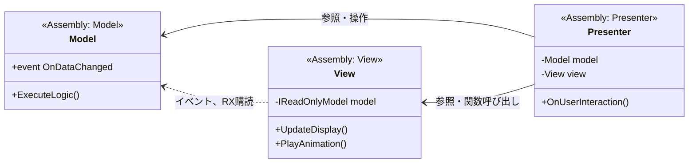
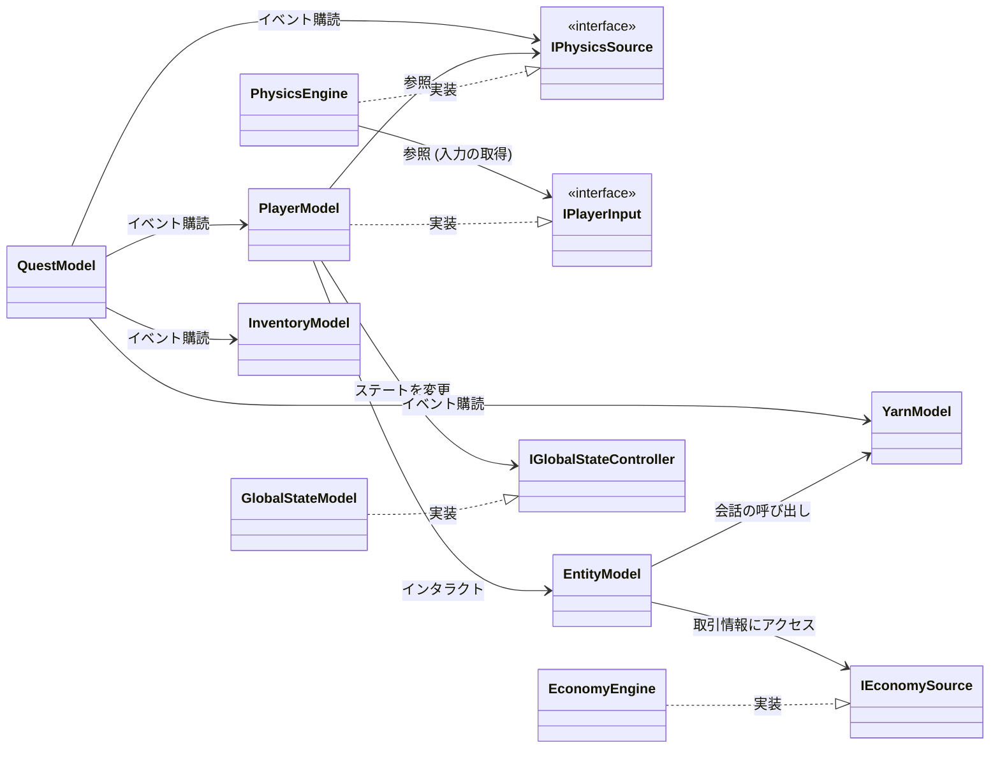

# Void Economy

- 製作者: Studio Acryll
- 1番作りたいものを、1番小さく作る: 
  - 完成率100%を目指す。どんなに壮大な構想も、リリースできなければ意味がない。
  - リリース日: 4/1
- コア体験: 極限の孤独（宇宙）と、不条理な礼儀を伴う交易、そして記憶の断片（リミナルスペース）。行ってみれば、「宇宙規模の神社巡り」である
- ターゲット: 世界観の没入感と、独自の交易サイクルを好むプレイヤー
  - [リサーチ] ターゲット像の明確化、購買基準の調査が必要
- 優先順位
  - 惑星Fogに到達したときの演出
  - 惑星Fogの世界観
  - 
  - ストーリー
- 境内の面白さ（Surface） と 宇宙空間（Space）の面白さ のどちらを優先すべきか
  - 全体
    - 奥行、探索を通じた新しい発見
    - 世界の手触り。現実に寄せる必要はなく、そこに一つの世界があることを信じさせる
    - 
  - Surface
    - 行商、キャラクターとの対話
    - 世界観 リミナルスペース BGM
    - 散歩とややホラーなダンジョンの探索
  - Space
    - スイングバイアクション
    - 宇宙の奥行、探索を通じた新しい発見
    - 美しい孤独感、BGM
- ナラティブに「宇宙に行きたい」という憧れを追加。それを祈願してしまったから、宇宙に行く人間として魅入られてしまった的な

# 表現したい・伝えたいこと一覧（添削しない）

- 孤独の美しさ

  - 孤独＋ノスタルジー ＝ 自分で選んだ孤独。

- 日本の空虚さ、美しさ

- 神社愛

- 通常の神社巡りで得ることができる成分を濃縮して摂取してもらう

- ねこ愛

- 人はみな他人に無関心である

- 日本ホラー
  - 風刺ではない「架空の日本」で怖がらせる
  - 神社: 無限に続く参道。通り過ぎると描画されなくなり、戻れなくなる。
    - ♪放浪記
  - データセンター: 内部にサーバーと鳥居、自然が同居する迷宮。
    - ♪データセンター
  - 広告の街: 成長し続ける、商業的すぎる街
    - 若いエネルギーを感じる
    - 
  - 
  - 神々
    - 人より少し大きい猫の怪物
    - 円柱型の水槽に浮かぶ脳
  - 認知症
    - 忘れていく過程を描く
    - 記憶を取り戻しに行くが、見てはいけないものを見てしまい、過去と決別することを決意する。

  - 行商の手触り
    - 人情で価値のないものを買ってしまう
    - 正解がない、あるのは成長の実感
    - 

- 世界の広さ
  - 惑星Fogからすごく人類を幸せにするものを持ち帰るミッションを課される。もしくは惑星Fog到達したはいいものの、1日が終わる瞬間もしくは一定期間ごとに記憶がすべて消えてしまう。Fogと地球での記憶のふるまいの違いから、記憶の正体に気が付く
  - いけないと思った場所に行ける。通り過ぎてきたドアやマンホールのふたが、すべて空くことに気が付く

- 記憶の不確かさ、恐ろしさ
  - 自分の日記の変容を読み、記憶が恐ろしく捻じ曲げられていく様を知る
    - 愛する人を忘れる
    - 自分の夢を忘れる
  - Fogの忘却の霧に触れると、スキルレベルが減っていく
  - 忘却状態では、時間が早送りになる
    - 息子がビデオレターを送ってくるが、どんどん年老いていく
    - 誰かわからなくなっていく
  - 「忘れるな、、、弱さを。自由を。目的を。」

- ~~働くことの恐ろしさ~~
  - 神々のために日々行商を繰り返す

- 惑星Fogには、地球で誰かが忘れた記憶が現れる。プレイヤーはFogの住人（神々）から記憶を買い戻し、地球に持って帰る。

# 機能要件

- ディスプレイ: 横画面を想定。16:9, 16:10 を想定。

## 1. 宇宙空間での移動→SpacePhysicsEngine

- [x] マウス操作での移動: クリックしている間、プレイヤーから見たマウスポインターの方向に加速する
- [x] 重力: 複数の重力源に影響される。実際の物理法則に基づいて、距離とともに減衰する
- [ ] 星に近づいたとき: 
  - [ ] スイングバイ奥行きを用いて、星がだんだん大きくなることで近づいていることを表現する。
  - [ ] 十分に近づいたら、地表を下とする画角に回転→雲を突き抜ける→2Dの世界へ移行 

- [ ] ミニマップ: 星との距離が明確。矢印は、現在の入力を続けた場合と、入力なしの場合の両方を薄く表示し、押す⇔離すのアクションで濃い表示がその2つを滑らかに往復する。

## 2. 地上での移動→PlayerModel

- [ ] 無限横スクロール ParallaxModel
- [ ] キーボードでの移動
- [ ] マウス操作での移動: クリックしている間、プレイヤーから見てマウスポインターがある左右どちらかに向かって歩く
- [x] 歩くアニメーション
- [ ] 特定のオブジェクトに対してアクションを行う

## 始まりの神社を完成させる

- 地球にある小さな神社
- その神社を起点に考えればナラティブも考えやすいだろう
- 始まりの神社で祀られている神: 

## 終わりの神社のピクセルアート

-  宇宙空間に突如現れる立方体
- 鳥居がびっしり生えている
- Xでのエンゲージメントを徐々に高めていきたい。海外ファン向けにもアプローチしていきたいので英語でやってみようかな
- ここから逆算すればナラティブも考えやすい

## 3. 交易システム→EconomyEngine

### 詳細設定

- 神社

### 交易品

- [要検討] 交易する品によってストーリーに分岐を
  - 社会を不幸にする品: 薬物、武器、
  - 神社と神社による経済活動
- 交易品の選定
  - 建築資材
  - 祭祀用具

## 4. エンティティ

- 
- 地上座標を保持する
- 
- NPC
  - 内部状態を保持する
  - 好感度、会話の分岐（しばらく話さないと忘れられる）、

- 
  - 
- 

# Todo

## 3/5 [あと27日]

- [ ] 環境構築
  - [x] Unityプロジェクト作成
  - [x] README.md 作成
  - [ ] 本ドキュメントをGeminiに共有
- [ ] プロトタイプ作成
  - [x] 宇宙空間の移動
  - [ ] 地上での移動
  - [ ] 交易システム

# 設計

## 層間の依存関係

## Model層

- ~Engine: データ指向。データを集約し、キャッシュ効率よく計算する。基本的にはR3の通知で、毎フレーム変わる値はインターフェースで値を直接外部公開する。
- ~Model: オブジェクト指向。インターフェースを用いず、R3を用いて値の変化を通知する。
- 
  - SpacePhysicsManager
- Model一覧

