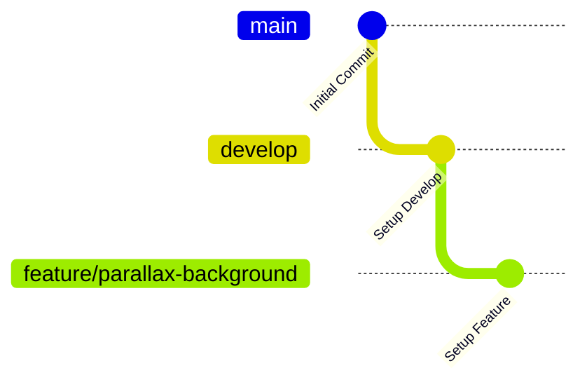

# Versions

```mermaid
gitGraph
    commit id: "Initial Commit"
    branch develop
    checkout develop
    commit id: "Setup Develop"
    branch feature/parallax-background
    checkout feature/parallax-background
    commit id: "Setup Feature"
```

