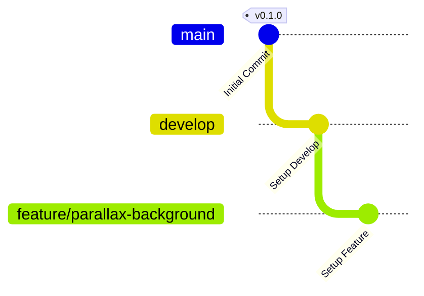

## バージョン予定

### 0.10 [24/3/25]

- [x] input
- [x] player-walking

### 0.20　Surface [3/28]

- Itch.ioで公開する。Discordサーバーを作成する。

- [x] 0.11 parallax-background
- [x] 0.12 entity
- [x] 0.13 player-entity-interact
- [ ] [assets] first-shrine
- [ ] 0.14 yarn
- [ ] 0.15 inventory-item
- [ ] 0.16 trade
- [ ] 0.17 quest
- [ ] 0.18 lift-off

### 0.30　Space [4/1]

- [ ] [assets] earth
- [ ] [assets] stars-background
- [ ] player-flying
- [ ] gravity-assist
- [ ] planet-config
- [ ] touchdown
- [ ] beautiful-background

### 0.40　Fog & Narrative [4/4]

- [ ] [assets] last-shrine

### 0.50　Red Planet

- Itch.ioの最低価格を徐々に引き上げる。Steamページを開設し、ウィッシュリストを集める。購入者にはSteamキーを配布する。

- [ ] inventory

### 0.60　Planets

### 0.70　α版

- アーリーアクセス版をSteamで販売開始する。

### 0.90　β版

- 本格リリース前にデバッグやバランス調整を行う。Steamの審査等を開始する。

### 1.00　リリース [26/8/1]

## gitGlaph

