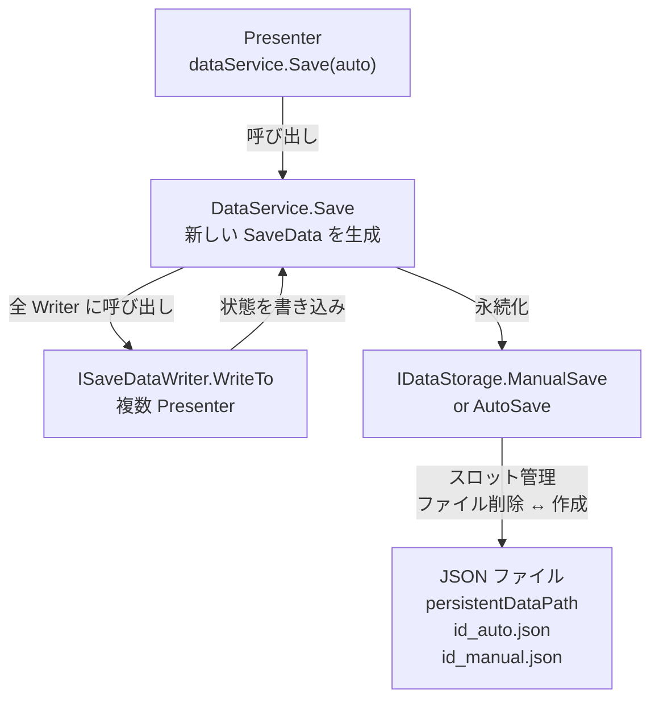
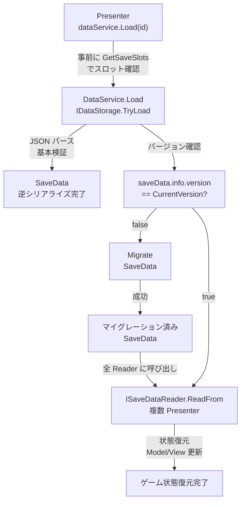

# feature/セーブ＆ロード機能

## 概要

Void Economy のゲーム進行状態（プレイヤー位置、ダイアログ進捗、シーン情報、Yarn 変数）をローカルファイルに永続化し、後のセッションで復元する機能です。

**スロットシステム：**
- 手動セーブスロット：1 個
- オートセーブスロット：5 個
- ID 採番：マニュアル・オートで同一系列の連番（0, 1, 2, ...）
- スロット満杯時：古いセーブを削除して上書き

**リリース目標：** v0.30（Space フェーズ）

---

## 要件

- 必要に応じてテスト駆動開発を取り入れる
- 基本検証を IDataStorage で実施、バージョン・機種互換性検証を DataService で実施
- マイグレーション関数で古いバージョンのセーブデータを自動変換
- Economy/Inventory/Entity のセーブパイプラインは実装し、データ内容は後で定義

---

## アーキテクチャ

### 層構造と責務分離

```
Presenter層（IDataService 利用者）
    ↓ Save/Load 要求
Service層（DataService + IDataStorage）
    ↓ 永続化
ファイルシステム（Application.persistentDataPath）
```

### インターフェース定義

#### **IDataService**（Presenter 層で実装）
```csharp
namespace Presenter
{
    public interface IDataService
    {
        void Save(bool auto);                    // auto=true:オートセーブ, false:手動セーブ
        void Load(int id);                       // スロット ID でロード
        List<SaveDataInfo> GetSaveSlots();       // セーブスロット一覧取得
    }
}
```

**役割：** ユーザー入力（ボタンクリック、タイミング）をセーブ・ロード機能に接続
**実装者：** 各 Presenter クラス（PlayerPresenter、YarnPresenter など）

---

#### **ISaveDataWriter**（各 Presenter が実装）
```csharp
namespace Presenter
{
    public interface ISaveDataWriter
    {
        void WriteTo(SaveData data);
    }
}
```

**役割：** 自分の Model 状態を SaveData に書き込む
**呼び出しタイミング：** DataService.Save() 時
**実装責務：**
```csharp
public class PlayerPresenter : ISaveDataWriter
{
    public void WriteTo(SaveData data)
    {
        // PlayerModel の現在状態を saveData.player に書き込む
        data.player = new PlayerSaveData
        {
            isSurface = playerModel.IsSurface,
            position = playerModel.Position,
            forward = playerModel.Forward,
            velocity = playerModel.Velocity
        };
    }
}
```

---

#### **ISaveDataReader**（各 Presenter が実装）
```csharp
namespace Presenter
{
    public interface ISaveDataReader
    {
        void ReadFrom(SaveData data);
    }
}
```

**役割：** SaveData から自分の Model 状態を復元
**呼び出しタイミング：** DataService.Load() 時（マイグレーション後）
**実装責務：**
```csharp
public class PlayerPresenter : ISaveDataReader
{
    public void ReadFrom(SaveData data)
    {
        // saveData.player から Model を復元
        playerModel.SetPosition(data.player.position);
        playerModel.SetForward(data.player.forward);
        playerModel.SetVelocity(data.player.velocity);
        // Model の observable を通じて、View は自動的に更新される
    }
}
```

---

#### **DataService**（Service 層）
- **役割：** Writer/Reader の管理、Save/Load フロー、バージョン・マイグレーション管理
- **実装構造：** IDataService を実装
- **内部構成：**
  - `HashSet<ISaveDataWriter> _writers` — セーブ時に呼び出す
  - `HashSet<ISaveDataReader> _readers` — ロード時に呼び出す
  - `IDataStorage _dataStorage` — ファイル I/O 委譲
  - `const string CurrentVersion = "0.30"` — マイグレーション判定用

---

#### **IDataStorage**（Storage 層インターフェース）
```csharp
namespace Service
{
    public interface IDataStorage
    {
        List<SaveDataInfo> GetSaveDataInfoList();
        bool ManualSave(SaveData saveData);
        bool AutoSave(SaveData saveData);
        bool TryLoad(int id, out SaveData saveData);
    }
}
```

**役割：** ファイル I/O、スロット管理、基本検証
**実装者：** JsonDataStorage（JSON ファイル形式）

---

### GlobalRoot での初期化

DataService の Writer/Reader は GlobalRoot の Initialize() メソッド内で登録：

```csharp
public class GlobalRoot : MonoBehaviour, ISceneRoot
{
    public void Initialize()
    {
        var dataService = new DataService(defaultSaveData);
        dataService.Initialize(new JsonDataStorage());
        
        // 各 Presenter を Writer/Reader として登録
        var playerPresenter = new PlayerPresenter(...);
        if (playerPresenter is ISaveDataWriter w) dataService.RegisterWriter(w);
        if (playerPresenter is ISaveDataReader r) dataService.RegisterReader(r);
        
        var yarnPresenter = new YarnPresenter(...);
        if (yarnPresenter is ISaveDataWriter w) dataService.RegisterWriter(w);
        if (yarnPresenter is ISaveDataReader r) dataService.RegisterReader(r);
        
        // Economy/Inventory/Entity Presenter も同様に登録
    }
}
```

---

## データフロー

### Save フロー



**詳細フロー：**

1. Presenter が `dataService.Save(auto: false)` を呼び出し
2. DataService が新しい SaveData インスタンスを生成
3. DataService が全 ISaveDataWriter に `WriteTo(saveData)` を呼び出し（例外時は Debug.LogError）
   - PlayerPresenter → `saveData.player` を更新
   - YarnPresenter → `saveData.yarn` を更新
   - EconomyPresenter → `saveData.economy` を更新（後で実装）
   - など
4. DataService が IDataStorage に以下を呼び出し：
   - `ManualSave(saveData)` （auto=false 時）
   - `AutoSave(saveData)` （auto=true 時）
5. IDataStorage が以下を実行：
   - 次のセーブ ID を決定（既存スロット + 1）
   - スロット制限を確認（手動：1 個、オート：5 個）
   - 制限超過時：最古の該当スロットをファイル削除
   - JSON ファイルを新規作成（エラー耐性のため削除→新規、置き換えではない）

---

### Load フロー



**詳細フロー：**

1. Presenter が UI で `GetSaveSlots()` を呼び出し、セーブスロット一覧を取得
2. Presenter が有効な ID を選択して `dataService.Load(id)` を呼び出し
3. DataService が IDataStorage に `TryLoad(id, out saveData)` を呼び出し
4. IDataStorage が以下を実行（失敗時は false を返す）：
   - `<id>_auto.json` または `<id>_manual.json` を読み込み
   - JsonUtility.FromJson で逆シリアライズ
   - 基本検証：null チェック、SaveDataInfo の有効性確認
5. DataService がバージョン互換性を検証
   - `saveData.info.version != CurrentVersion` → `Migrate(saveData, fromVersion, toVersion)`
   - マイグレーション失敗時：Exception をスロー → UI に通知
6. DataService が全 ISaveDataReader に `ReadFrom(saveData)` を呼び出し（例外時は Debug.LogError）
   - PlayerPresenter → `saveData.player` から PlayerModel を復元
   - YarnPresenter → `saveData.yarn` から YarnModel を復元
   - EconomyPresenter → `saveData.economy` から EconomyModel を復元（後で実装）
   - など
7. 各 Reader が Model を復元し、Model の R3 observable が通知 → View が自動更新

---

## データ構造

### SaveData（Core 層、実装済み）

```csharp
[Serializable]
public class SaveData
{
    public SaveDataInfo info;              // メタデータ（ID、時刻、バージョン）
    public GlobalStateSaveData global;     // シーン情報（Surface/Space）
    public PlayerSaveData player;          // プレイヤー位置・速度
    public List<YarnVariable> yarn;        // ダイアログ状態

    // 未実装（パイプラインのみ定義）
    // public EconomySaveData economy;
    // public InventorySaveData inventory;
    // public EntitySaveData entity;

    public SaveData DeepCopy()
    {
        // JSON 往復で深いコピー実現（完全な独立）
        string json = JsonUtility.ToJson(this);
        return JsonUtility.FromJson<SaveData>(json);
    }
}
```

### SaveDataInfo（メタデータ）

```csharp
[Serializable]
public struct SaveDataInfo
{
    public int id;                         // セーブ ID（0, 1, 2, ... 連番）
    public string name;                    // プレイヤー命名（未実装）
    public string savedAt;                 // 日時文字列（ISO 8601 形式）
    public bool autoSave;                  // オートセーブ フラグ（true: オート, false: 手動）
    public long savedAtUnixMs;             // Unix timestamp ミリ秒（GetSaveSlots でソート用）
    public string screenshotFileName;      // スクリーンショット画像ファイル名（未実装）
    public string version;                 // ゲームバージョン（例："0.30"）
}
```

### 各データ構造（Core 層）

| 構造 | 内容 | 実装状況 |
|------|------|--------|
| **PlayerSaveData** | プレイヤー位置、向き、速度、Surface/Space フラグ | ✅ 実装済み |
| **GlobalStateSaveData** | 現在のシーン（SceneType.Title/Surface/Space） | ✅ 実装済み |
| **YarnVariable** | ダイアログ変数（key, value, type） | ✅ 実装済み |
| **EconomySaveData** | プレイヤー通貨、取引履歴 | ❌ 未実装（構造のみ） |
| **InventorySaveData** | プレイヤーアイテム所持リスト | ❌ 未実装（構造のみ） |
| **EntitySaveData** | NPC/神社の状態 | ❌ 未実装（構造のみ） |

---

## セーブスロット管理

### ID 採番とスロット制限

**ルール：**
- セーブ ID は **全体で連番**（マニュアル・オート混在）：0, 1, 2, ...
- 手動セーブ：最大 1 個（新しいセーブで既存の手動セーブを上書き）
- オートセーブ：最大 5 個（古い順に削除）
- スロット満杯時：最古のセーブを削除 → 新規作成

**ファイル命名規則：**
```
<id>_manual.json    （手動セーブ）
<id>_auto.json      （オートセーブ）
```

### 例：セーブ進行の様子

**New Game 直後**
```
（セーブなし）
```

**Save(false) → AutoSave → AutoSave → Save(false)**
```
0_manual.json   ← 最初の手動セーブ
1_auto.json
2_auto.json
3_manual.json   ← 手動セーブで 0_manual.json を上書き（削除→作成）
```

**AutoSave を繰り返す（オートスロット 5 個満杯後）**
```
3_manual.json
4_auto.json
5_auto.json
6_auto.json
7_auto.json
8_auto.json     （5 個）
9_auto.json     ← 6 番目のオートセーブ：4_auto.json（最古）を削除
```

### IDataStorage の責務

- `GetSaveDataInfoList()` — 全セーブスロットのメタデータを返す（SaveDataInfo リスト）
- `ManualSave(SaveData)` — 手動セーブ（既存手動セーブは削除）
- `AutoSave(SaveData)` — オートセーブ（スロット 5 個制限、超過時は最古削除）
- `TryLoad(int id, out SaveData)` — 指定 ID でロード（失敗時は false）

---

## バージョン管理とマイグレーション

### 現在バージョンの定義

```csharp
// DataService.cs 内
private const string CurrentVersion = "0.30";
```

### マイグレーション実行

Load 時のバージョン互換性検証：

1. IDataStorage から SaveData を読み込み（基本検証済み）
2. `saveData.info.version` を確認
3. `version != CurrentVersion` の場合：
   - `Migrate(saveData, fromVersion, targetVersion)` を実行
   - マイグレーション失敗 → Exception をスロー（ゲーム起動時に UI から通知）
4. マイグレーション成功 → 全 Reader に ReadFrom を呼び出し

### マイグレーション関数（実装予定）

```csharp
// DataService.cs 内
private readonly Dictionary<string, Action<SaveData>> migrations = new()
{
    { "0.20", MigrateFrom0_20 },
    { "0.25", MigrateFrom0_25 },
    // v0.30 に向けた段階的マイグレーション
};

private SaveData Migrate(SaveData data, string fromVersion, string toVersion)
{
    // fromVersion から toVersion へのマイグレーションチェーン実行
    // 例：0.20 → 0.25 → 0.30
}

private void MigrateFrom0_20(SaveData data)
{
    // 例：PlayerSaveData に新しいフィールドを追加
    // data.player.newField = defaultValue;
}
```

---

## 拡張ポイント：Economy/Inventory/Entity セーブの追加

Economy、Inventory、Entity などの新しいデータをセーブ・ロード対象に追加する場合、以下の 3 ステップで容易に拡張可能です。

### **ステップ 1：SaveData にデータ構造を定義**

```csharp
// Core/SaveData.cs に追加
[Serializable]
public struct EconomySaveData
{
    public int playerMoney;
    public List<int> ownedItemIds;
}
```

### **ステップ 2：Presenter に ISaveDataWriter/Reader を実装**

```csharp
// Service/EconomyPresenter.cs
public class EconomyPresenter : ISaveDataWriter, ISaveDataReader
{
    private readonly EconomyModel economyModel;
    
    public void WriteTo(SaveData saveData)
    {
        // Model から SaveData に書き込み
        saveData.economy = new EconomySaveData
        {
            playerMoney = economyModel.PlayerMoney,
            ownedItemIds = economyModel.GetOwnedItemIds()
        };
    }

    public void ReadFrom(SaveData saveData)
    {
        // SaveData から Model に復元
        economyModel.SetPlayerMoney(saveData.economy.playerMoney);
        economyModel.RestoreOwnedItems(saveData.economy.ownedItemIds);
    }
}
```

### **ステップ 3：GlobalRoot で DataService に登録**

```csharp
// Root/GlobalRoot.cs の Initialize() メソッド内
public void Initialize()
{
    var dataService = new DataService(...);
    
    var economyPresenter = new EconomyPresenter(...);
    
    if (economyPresenter is ISaveDataWriter w)
        dataService.RegisterWriter(w);
    
    if (economyPresenter is ISaveDataReader r)
        dataService.RegisterReader(r);
}
```

**これで完了！** Economy データは自動的にセーブ・ロード対象になります。

---

## 本実装完了（2026-06-24）

### DataService.cs の実装内容

**バージョン管理:**
```csharp
private const string CurrentVersion = "0.30";
```

**Save フロー:**
- SaveData に version, savedAt, savedAtUnixMs を設定
- 全 ISaveDataWriter に WriteTo(data) を呼び出し
- IDataStorage に ManualSave / AutoSave を委譲
- 例外時は Debug.LogError + throw

**Load フロー:**
- IDataStorage.TryLoad(id, out data) で SaveData 取得
- data.info.version != CurrentVersion 時は Migrate 実行
- マイグレーション失敗時は Exception をスロー
- 全 ISaveDataReader に ReadFrom(data) を呼び出し

**GetSaveSlots():**
- IDataStorage.GetSaveDataInfoList() でスロット情報を取得
- **ID を降順でソート** → 最新のセーブが最初に来る
- Presenter の UI に表示する際に使用

**マイグレーション:**
```csharp
private readonly Dictionary<string, Action<SaveData>> _migrations = new()
{
    // { "0.20", MigrateFrom0_20 },
    // { "0.25", MigrateFrom0_25 },
};

private void Migrate(SaveData data, string fromVersion, string toVersion)
{
    // v0.20 → v0.25 → v0.30 のチェーン実行
}
```

**Writer/Reader 管理:**
```csharp
public void RegisterWriter(ISaveDataWriter writer) { ... }
public void RegisterReader(ISaveDataReader reader) { ... }
```

### JsonDataStorage.cs の実装内容

**ファイル管理:**
- 保存先: `Application.persistentDataPath`
- ファイル形式: JSON
- 命名規則: `<id>_manual.json`, `<id>_auto.json`

**GetSaveDataInfoList():**
- ファイルシステムをスキャン（*.json）
- SaveDataInfo を抽出
- Unix timestamp でソート（新しい順）
- ※ DataService.GetSaveSlots() で ID 降順に再ソート

**ManualSave(SaveData):**
- 既存手動セーブをすべて削除
- 新規 ID を決定（max id + 1）
- JSON ファイルに保存

**AutoSave(SaveData):**
- オートセーブスロット数を確認
- 5 個以上 → 最古（Unix timestamp 最小）を削除
- 新規 ID を決定
- JSON ファイルに保存

**TryLoad(int id, out SaveData):**
- `<id>_manual.json` または `<id>_auto.json` を探す
- JsonUtility.FromJson で逆シリアライズ
- 基本検証: null チェック、ID ≥ 0
- 失敗時は false 返却

**ヘルパーメソッド:**
```csharp
private void DeleteExistingManualSaves() { ... }
private void DeleteOldestAutoSave() { ... }
private List<SaveDataInfo> GetManualSaveList() { ... }
private List<SaveDataInfo> GetAutoSaveList() { ... }
private int GetNextSaveId() { ... }
private string GetSaveFilePath(int id, bool isAutoSave) { ... }
```

---

## 実装済みコード

### ファイル一覧

```
Assets/Scripts/
├── Core/
│   └── SaveData.cs                         ✅ 実装済み（version フィールド追加）
│       ├── SaveData（クラス、DeepCopy メソッド）
│       ├── SaveDataInfo（メタデータ + version）
│       ├── PlayerSaveData
│       ├── GlobalStateSaveData
│       ├── YarnVariable
│       ├── EconomySaveData（構造のみ）
│       ├── InventorySaveData（構造のみ）
│       └── EntitySaveData（構造のみ）
│
├── Presenter/
│   ├── IDataService.cs                     ✅ 実装済み
│   ├── ISaveDataWriter.cs                  ✅ 実装済み
│   └── ISaveDataReader.cs                  ✅ 実装済み
│
└── Service/DataService/
    ├── DataService.cs                      ✅ 本実装完了
    │   ├── Save フロー（メタデータ設定、Writer 呼び出し）
    │   ├── Load フロー（バージョン検証、マイグレーション）
    │   ├── Writer/Reader HashSet 管理
    │   ├── バージョン管理（CurrentVersion = "0.30"）
    │   └── Migrate チェーン実装
    ├── IDataStorage.cs                     ✅ 実装済み
    ├── JsonDataStorage.cs                  ✅ 本実装完了
    │   ├── ファイル I/O（JSON 保存・読み込み）
    │   ├── スロット管理（手動 1 個、オート 5 個制限）
    │   ├── 基本検証（null チェック、ID 有効性）
    │   └── 削除・上書きロジック
    ├── DefaultSaveDataSO.cs                ✅ 実装済み
    └── CLAUDE.md                           ✅ このファイル（更新）
```

### DataService の実装状況

| メソッド/機能 | 状態 | 備考 |
|-----------|------|------|
| Save(bool auto) | ✅ 実装済み | Writer 呼び出し、メタデータ設定、例外処理あり |
| Load(int id) | ✅ 実装済み | Reader 呼び出し、バージョン検証、マイグレーション実行 |
| GetSaveSlots() | ✅ 実装済み | ID 降順でソート済み、最新セーブが最初 |
| Writer/Reader 管理 | ✅ 実装済み | HashSet、RegisterWriter/RegisterReader メソッド |
| Initialize(IDataStorage) | ✅ 実装済み | IDataStorage の初期化 |
| バージョン管理 | ✅ 実装済み | CurrentVersion = "0.30" |
| マイグレーション | ✅ 基盤実装 | Migrate チェーン実装（辞書拡張可能） |

---

## テスト対象

### 単位テスト（推奨）

| 対象 | テスト内容 | テスト方法 |
|------|----------|----------|
| **JsonDataStorage** | JSON シリアライズ/デシリアライズの正確性 | Mock SaveData で JSON ファイル生成・読み込み |
| **JsonDataStorage** | スロット管理（制限、削除ロジック） | 手動 1 個、オート 5 個の制限確認 |
| **SaveData.DeepCopy()** | 深いコピーが機能するか | コピー後、参照が独立しているか確認 |
| **Migrate 関数** | バージョン変換の正確性 | v0.20 → v0.30 などの変換が正確か |
| **IDataStorage.TryLoad** | 基本検証（null、型チェック） | 不正なデータで false を返すか |

### 手動テスト（統合確認）

- New Game → Save(false) → Load(0) → 状態復元確認
- AutoSave を複数回実行 → GetSaveSlots で 5 個制限確認
- 手動セーブ上書き確認（0_manual.json → 1_manual.json）
- 古いバージョンのセーブを手動で作成 → Load → マイグレーション確認

---

## 既知制限・TODO

### 実装完了（v0.30 リリース前）

- [x] JsonDataStorage の詳細実装（ファイル I/O、スロット管理）
  - [x] GetSaveDataInfoList() — ファイルシステム走査、メタデータ抽出
  - [x] ManualSave() — 既存手動セーブ削除 → 新規作成
  - [x] AutoSave() — スロット制限（5 個）、最古セーブ削除
  - [x] TryLoad() — JSON パース、基本検証（null、型チェック）
- [x] DataService のバージョン管理・マイグレーション
  - [x] Migrate() 関数の実装
  - [x] migrations 辞書の定義
  - [x] Load フロー内でバージョン検証
- [x] SaveDataInfo に version フィールドを追加

### 実装予定（v0.30 リリース前）

- [ ] 各 Presenter への ISaveDataWriter/Reader 実装
  - [ ] PlayerPresenter
  - [ ] YarnPresenter
  - [ ] （Economy/Inventory は後のバージョン）
- [ ] GlobalRoot での Writer/Reader 登録
- [ ] DataService.Initialize() を GlobalRoot で呼び出し
- [ ] 単体テスト実装
  - [ ] JsonDataStorage
  - [ ] SaveData.DeepCopy
  - [ ] Migrate 関数

### 後のバージョン向け（v1.0 以降）

- [ ] Economy/Inventory/Entity のセーブデータ内容実装
- [ ] エラー通知メカニズム（例：IDataServiceError インターフェース）
- [ ] スクリーンショット保存・サムネイル表示
- [ ] マニュアルセーブの複数スロット化（3～5 スロット）
- [ ] Cloud セーブ対応（Steam Cloud など）
- [ ] セーブデータ破損時のリカバリー機能

---

## 開発ノート

### SaveData.DeepCopy の設計

JSON 往復で完全な深いコピーを実現：
```csharp
public SaveData DeepCopy()
{
    string json = JsonUtility.ToJson(this);
    return JsonUtility.FromJson<SaveData>(json);
}
```
**利点：** 参照型フィールド（List など）も完全に独立。シリアライズ可能な型なら自動対応。

### ISaveDataWriter/Reader の拡張性

Economy Presenter を追加する際、DataService の変更は **全く不要**。3 ステップで完結：
1. SaveData に EconomySaveData を定義
2. Presenter に Writer/Reader を実装
3. GlobalRoot で登録

この設計により、v1.0 で Economy を追加する際も、既存の Save/Load パイプラインに干渉しない。

### IDataStorage インターフェースの利点

- **実装の多様性** — JsonDataStorage 以外に、SQLiteDataStorage、BinaryDataStorage なども容易に追加可能
- **テスト容易性** — Mock IDataStorage を用意すれば、ファイル I/O なしで DataService をテスト可能
- **責務分離** — DataService はセーブロジック、IDataStorage はファイル形式に専念

---

## 参考資料

- **SaveData.cs** — Core 層、全データ構造の定義
- **IDataService.cs** — Presenter 層、サービスインターフェース
- **ISaveDataWriter.cs**, **ISaveDataReader.cs** — Presenter 層、データ読み書きインターフェース
- **IDataStorage.cs** — Service 層、ストレージインターフェース
- **ROADMAP.md** — プロジェクト全体の機能仕様、バージョンマイルストーン
- **README.md** — プロジェクトビジョン